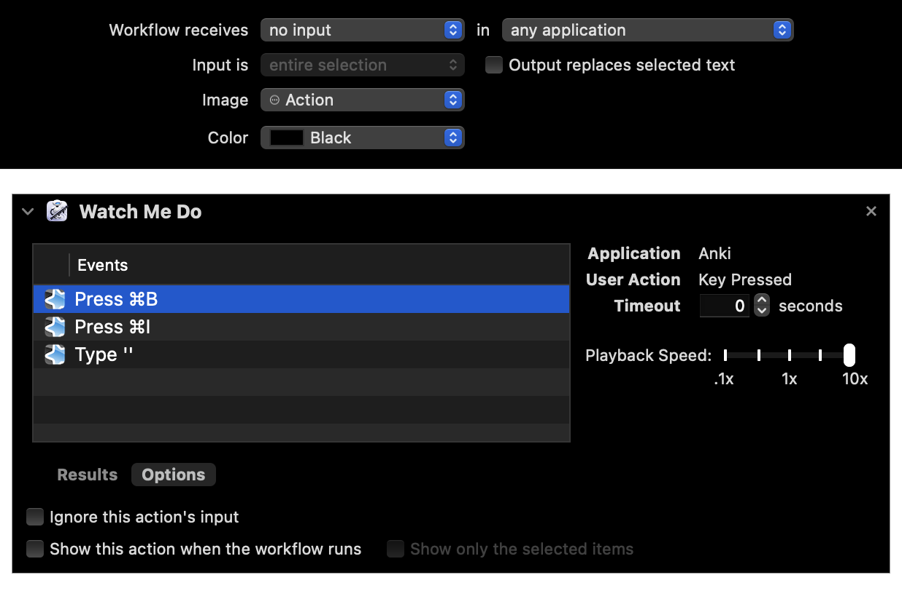
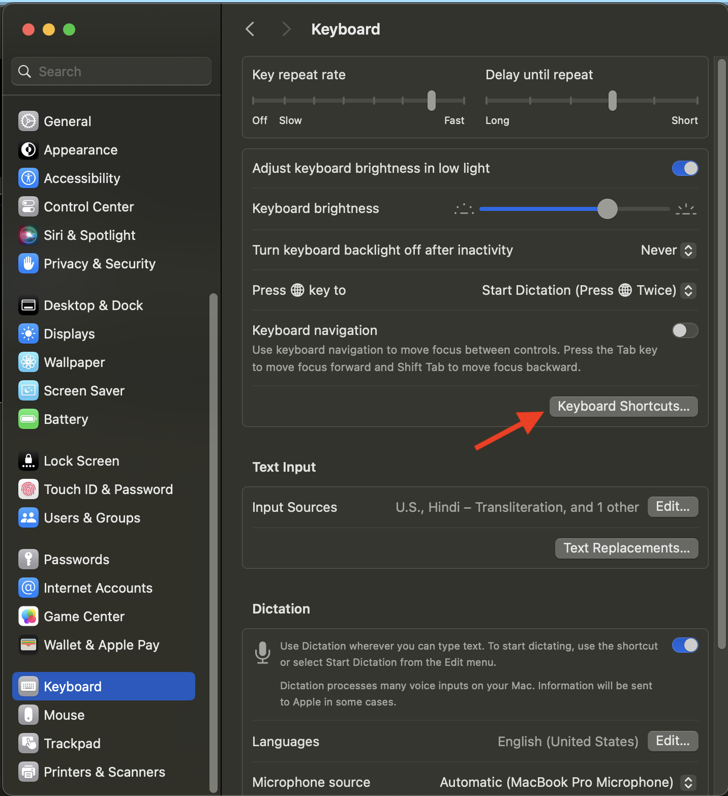

# Anki Automator for Text Highlight

## Step 1: Create automator service as shown here.

## Step 2: Set keyboard shortcut in Mac Preferences

System Preferences > Keyboard > Keyboard Shortcuts > Services >
General > Highlight

### Notes

- `Alt + Shift + ]` does not work.
- `Cmd + Shift + ]` is hence used.
